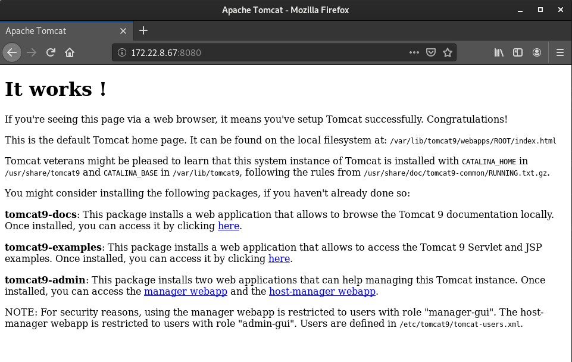
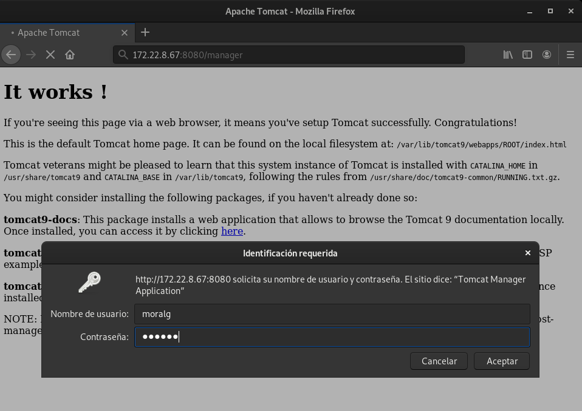
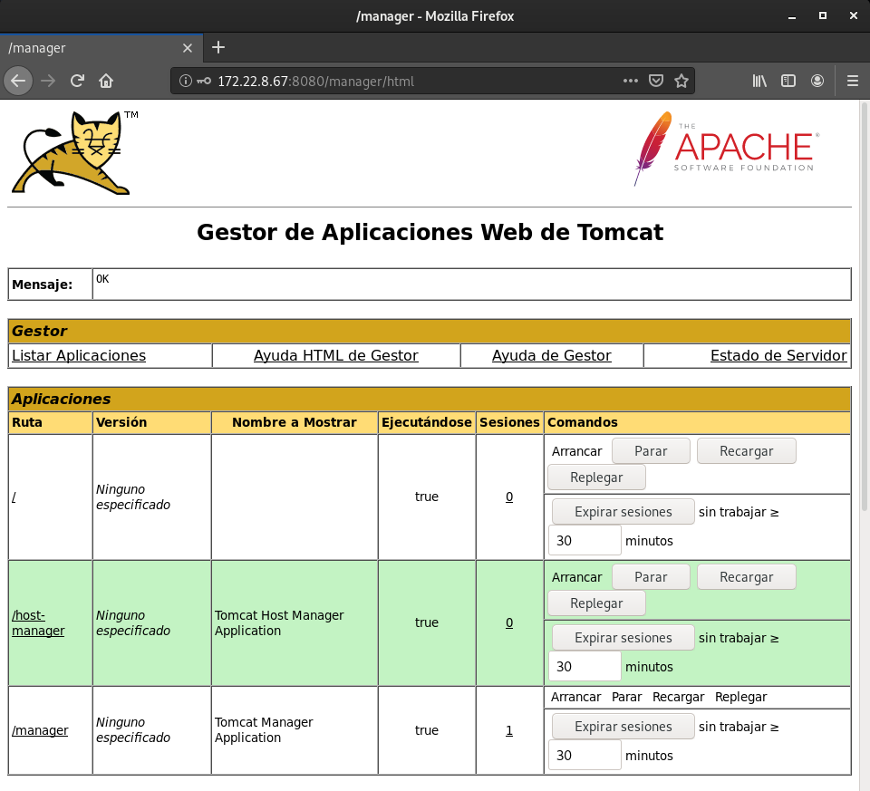
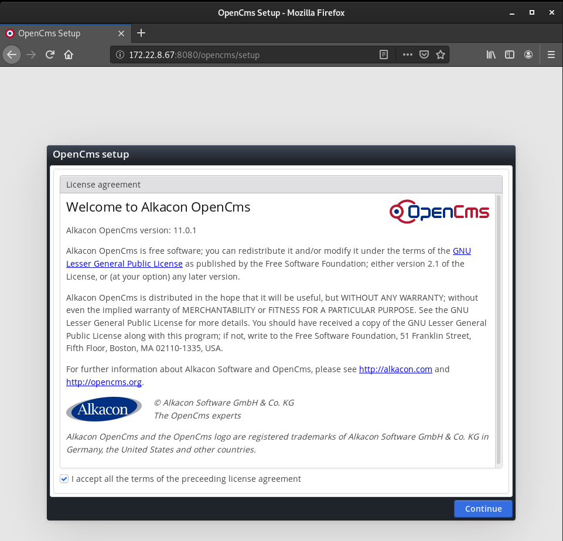
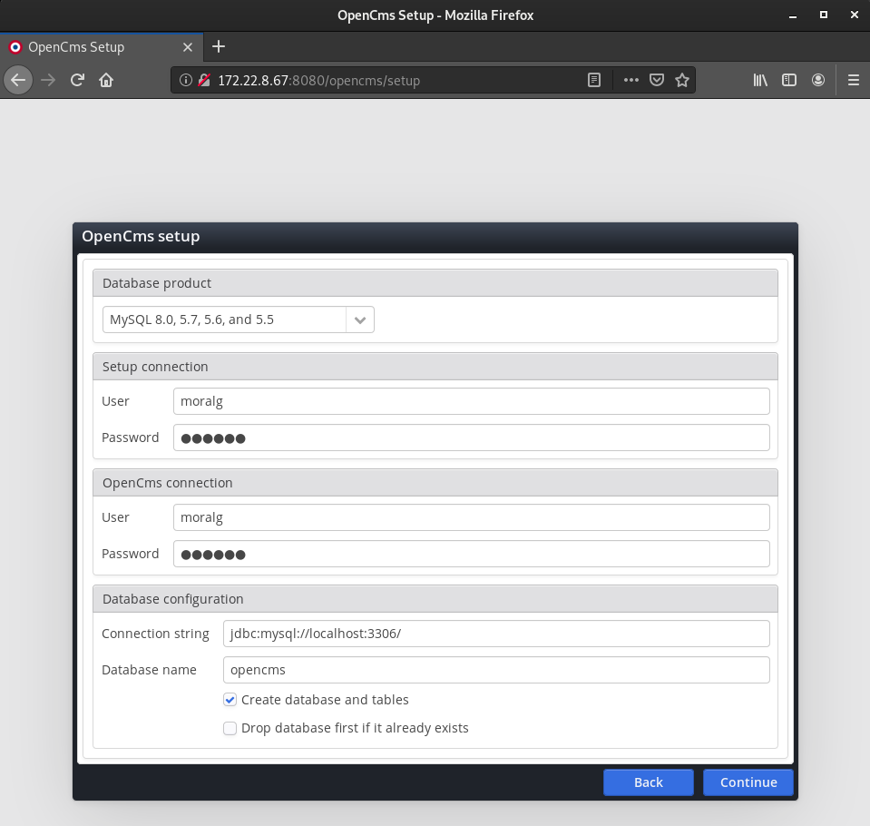
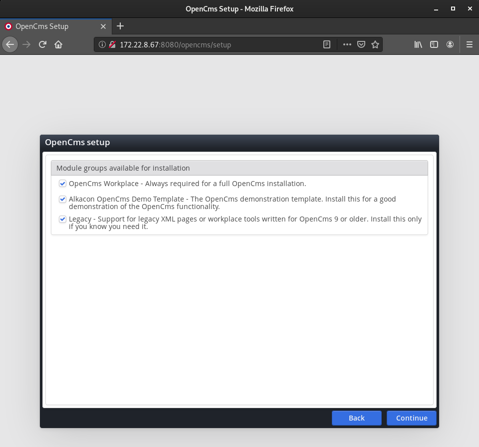
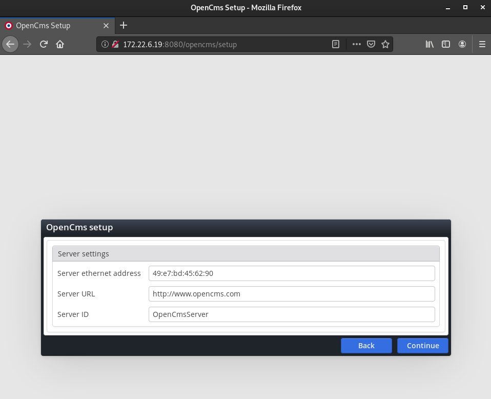
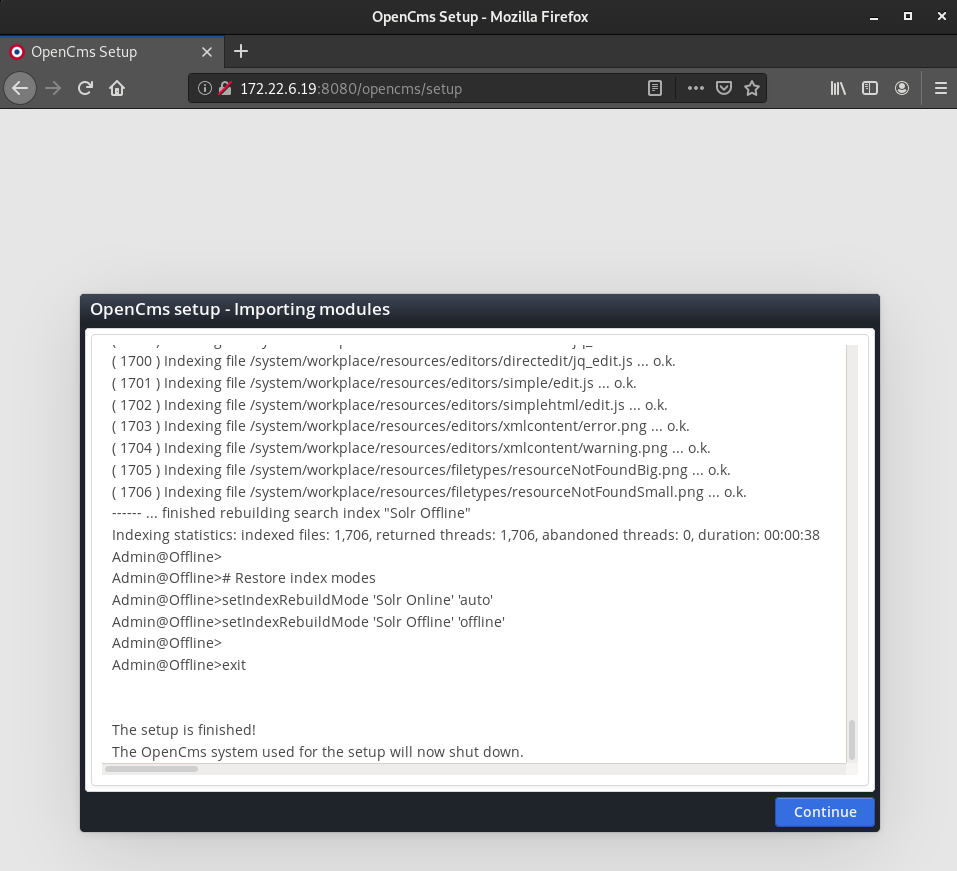
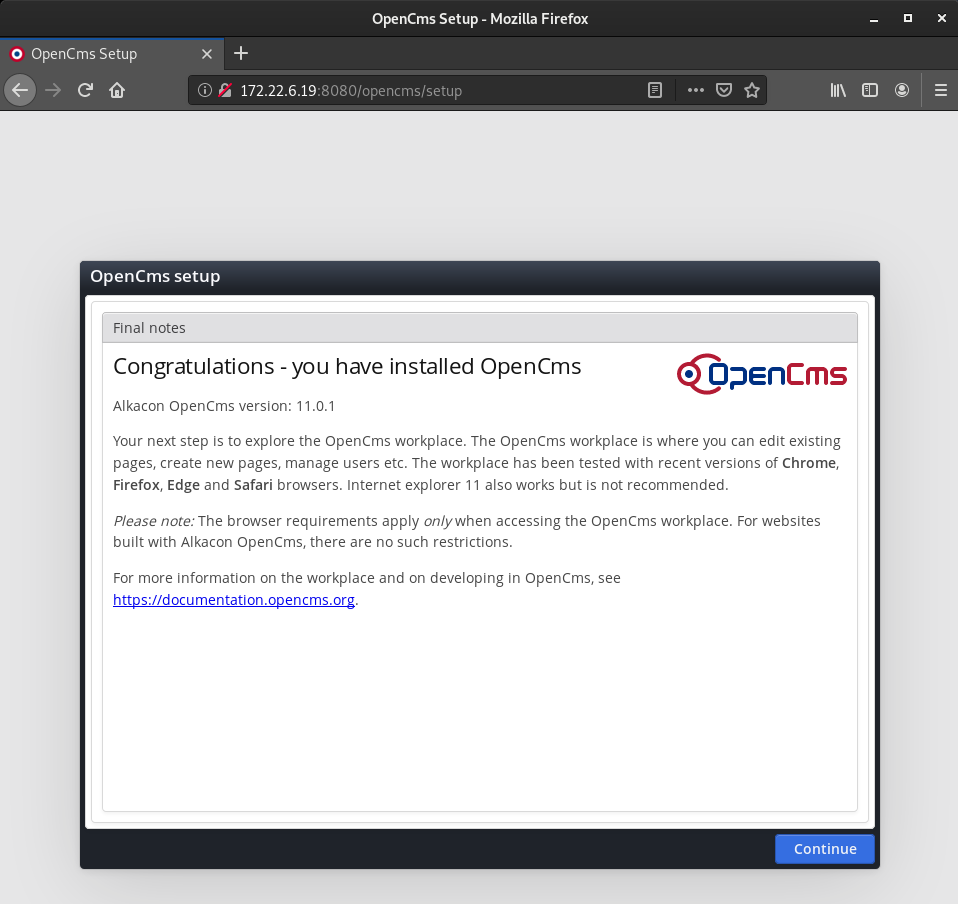
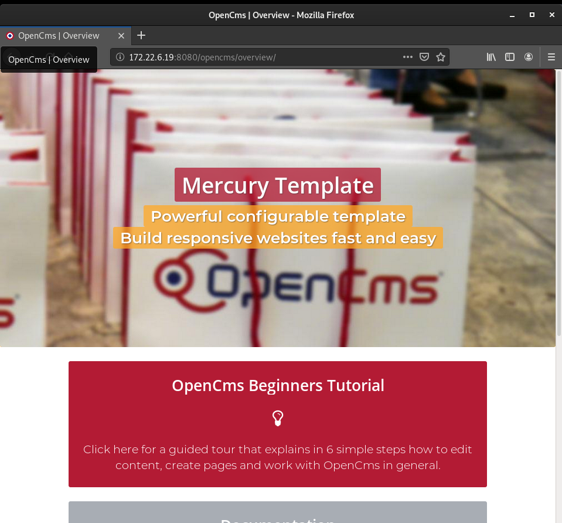

# Despliegue de openCMS

**Configuración del escenario**

~~~
Vagrant.configure("2") do |config|

  config.vm.define :servidor1 do |servidor1|
    servidor1.vm.box = "debian/buster64"
    servidor1.vm.hostname = "openCMS"
    #servidor1.vm.network :public_network,:bridge=>"wlp2s0" 
    servidor1.vm.network :public_network,:bridge=>"ens3p0"
    servidor1.vm.provider :virtualbox do |server|
	server.customize ["modifyvm", :id, "--memory", 2048]
    end
  end
end
~~~

OpenCms es un sistema de gestión de contenido de código abierto basado en Java y en tecnología XML. Este cms lo vamos a implementar con la ayuda de Tomcat, que es un contenedor web con soporte de servlets y JSPs.

**Instalación de Toncat**

Instalamos el paquete de `tomcat`.
~~~
sudo apt install tomcat9
~~~

Nada más terminar la instalación, ya podremos acceder a la página de prueba accediendo por el puerto 8080.

Si estamos instalando tomcat9 en una instancia de OpenStack, y por las limitaciones de las máquinas virtuales en la generación pseudoaleatoria, es necesario modificar el fichero `/usr/lib/jvm/java-8-openjdk-amd64/jre/lib/security/java.security`, y cambiar la siguiente línea:

~~~
securerandom.source=file:/dev/./urandom
~~~

Después de esto vamos a reinciar el servicio

---------------------------------------------------------------------

**Extra**

Vamos a instalar una herramienta proporciaonada por la fundación Apache para facilitar el despliegue de aplicaciones y el manejo del servidor, se llama **Tomcat-Manager**.

~~~
sudo apt install tomcat9-admin
~~~

Una vez instalado tenemos que crear un usuario con permisos para acceder. Para crearlo tenemos que ir al fichero `/etc/tomcat9/tomcat-users.xml` y añadir las siguientes lineas:
~~~
<role rolename="manager-gui"/>
<user username="moralg" password="moralg" roles="manager-gui"/>
~~~

Guardamos y accedemos a la dirección web por el puerto 8080 con la página de administración, en mi caso `http://172.22.8.67:8080/manager/html`.

Podemos ver que nos pide el usuario y la contraseña.

Si introducimos bien los datos nos aparecerá la zona de administración

---------------------------------------------------------------------------

**Instalación de openCMS**

Ahora vamos a descargarnos el cms de la [página oficial](http://www.opencms.org/en/modules/downloads/begindownload.html?id=b192f2af-ce4a-11e9-8925-7fde8b0295e1).

~~~
wget http://www.opencms.org/en/modules/downloads/begindownload.html?id=b192f2af-ce4a-11e9-8925-7fde8b0295e1
~~~

Movemos la aplicación a `/var/lib/tomcat9/webapps` y la descomprimimos. 
~~~
sudo mv opencms-11.0.1.zip /var/lib/tomcat9/webapps/
sudo unzip opencms-11.0.1.zip 
~~~

Antes de seguir, tenemos instsalar MariaDB y crear un usuario con privilegios. La base de datos y las tablas se crean automáticamente al realizar el instalador de openCMS.

Instalamaos mariaDB
~~~
sudo apt install mariadb-server
~~~

Creamos usuario con privilegios.

~~~
MariaDB [(none)]> CREATE USER 'moralg'@'localhost' IDENTIFIED BY 'moralg';
Query OK, 0 rows affected (0.001 sec)

MariaDB [(none)]> GRANT ALL PRIVILEGES ON * . * TO 'moralg'@'localhost';
Query OK, 0 rows affected (0.001 sec)

MariaDB [(none)]> FLUSH PRIVILEGES;
Query OK, 0 rows affected (0.001 sec)
~~~

Nos dirigimos a la dirección `http://172.22.8.67:8080/opencms/setup` para que nos muestre el instalador.

Aceptamos los terminos

Le indicamos que la base de datos que vamos a utilizar es `MySQL 8.0, 5.7, 5.6, and 5.5`, el usuario y contraseña de la base de datos, usuario y contraseña de la aplicación, la conexión la dejamos igual y aquí, si no hemos creado la base de datos, marcamos la opción `Create database and tables`.

Empezara a importar los módulos y la configuración, una vez terminado hacemos click en siguiente.

